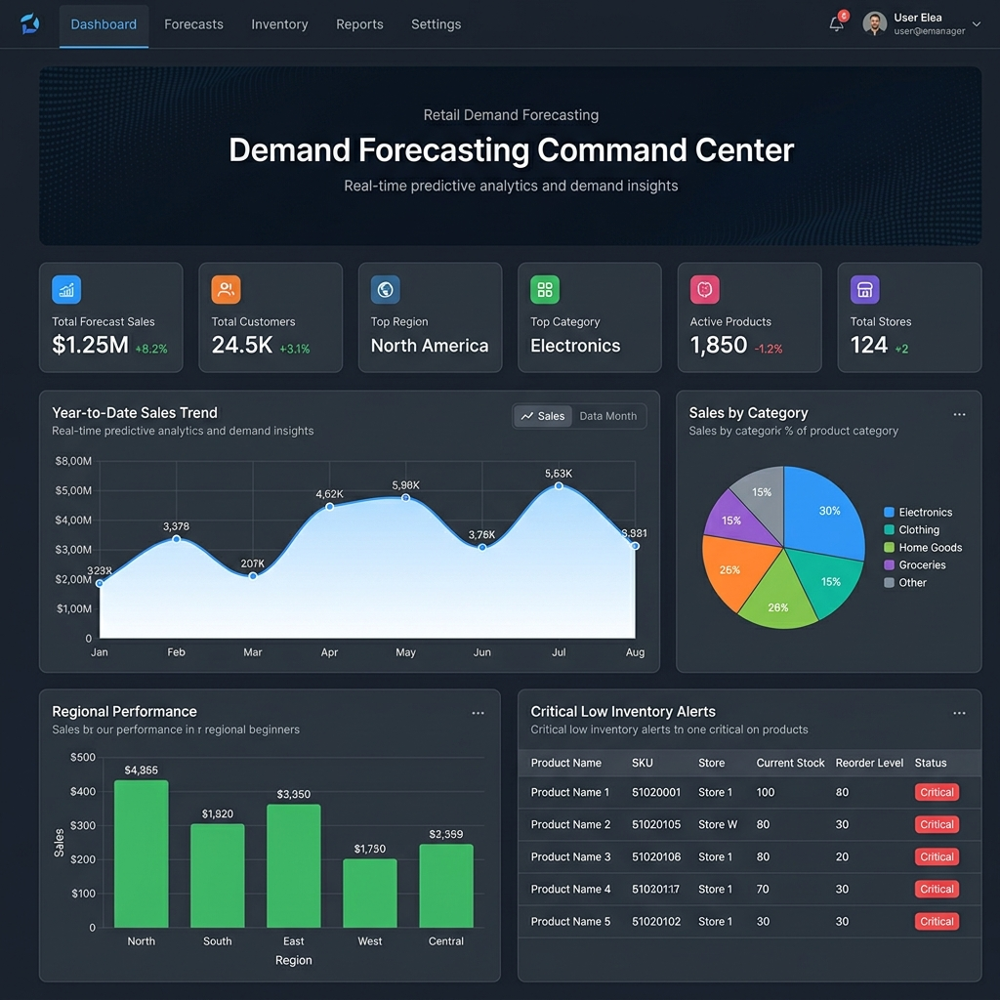
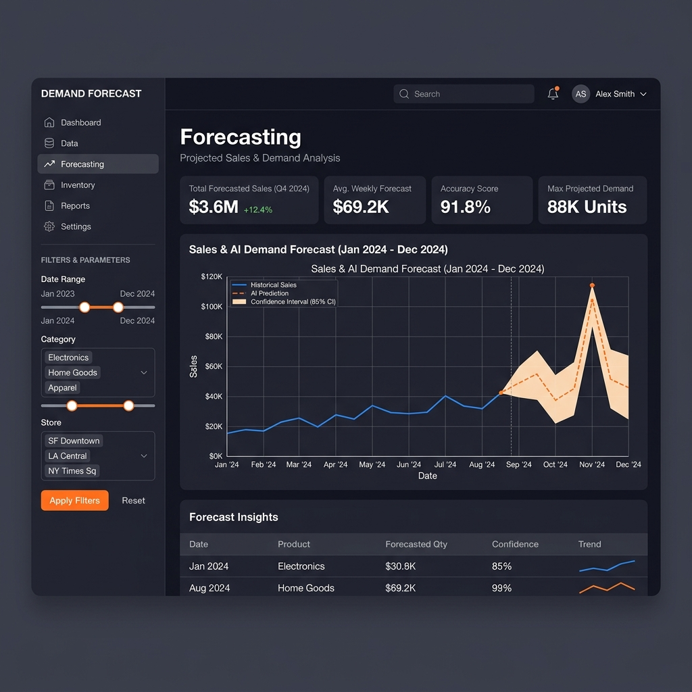

<div align="center">

# 🛒 Retail Demand Forecasting

**Real-Time Sales & Inventory Optimization Command Center**

[](https://www.python.org/downloads/)
[](https://streamlit.io/)
[](https://opensource.org/licenses/MIT)

A modern, machine learning-powered web dashboard designed to forecast retail demand, optimize inventory, and maximize profitability through real-time predictive analytics.

</div>

---

## 🌟 Overview

The **Retail Demand Forecasting System** is a data-heavy, professional application that helps retailers stay ahead of market trends. By leveraging machine learning and an intuitive UI, this platform allows store managers, inventory planners, and executives to monitor sales trajectories, spot low-inventory alerts, and access AI-driven demand predictions across different regions, categories, and stores.



## ✨ Key Features

- **📊 Comprehensive Command Center:** Instantly visualize Total Forecast Sales, Customer Count, Top Regions, and Top Categories via sleek KPI ribbons.
- **🤖 AI-Powered Forecasting:** Interactive time-series forecasting to predict future sales trends alongside historical data and confidence intervals.
- **⚠️ Inventory Optimization Alerts:** Real-time critical low-inventory alerts indicating precise product, store, and current stock status to prevent stockouts.
- **🌍 Regional & Categorical Breakdown:** Deep-dive analytics into how specific regions and product categories are performing over the Year-to-Date (YTD).
- **🎛️ Interactive Data Filtering:** Drill down by specific date ranges, categories, and stores using an intuitive sidebar to get tailored insights.



## 🛠️ Tech Stack

- **Frontend & UI:** [Streamlit](https://streamlit.io/) (for building the modern, dark-themed dashboard), HTML/CSS
- **Data Manipulation:** `pandas`, `numpy`
- **Data Visualization:** `plotly`, `matplotlib`
- **Machine Learning / Stats:** `scikit-learn`, `statsmodels`

## 📁 Project Structure

```text
Retail-Demand-Forecasting/
├── .streamlit/             # Streamlit configuration files
├── assets/                 # Images, icons, CSS styling, UI components
├── dashboard/              # Additional dashboard logic
├── dataset/                # Raw and processed datasets (e.g., dashboard_data.csv)
├── models/                 # Pre-trained ML models and scalers
├── notebook/               # Jupyter Notebooks for exploratory data analysis (EDA)
├── pages/                  # Streamlit multi-page setup (Overview, Analysis, Forecasting)
├── app.py                  # Main Streamlit application entry point
├── train_model.py          # Script used to train predictive models
└── requirements.txt        # Python dependencies
```

## 🚀 Installation & Usage

1. **Clone the repository:**
   ```bash
   git clone https://github.com/aniket6391/Retail-Demand-Forecasting.git
   cd Retail-Demand-Forecasting
   ```

2. **Create a virtual environment (optional but recommended):**
   ```bash
   python -m venv venv
   source venv/bin/activate  # On Windows use: venv\Scripts\activate
   ```

3. **Install the dependencies:**
   ```bash
   pip install -r requirements.txt
   ```

4. **Run the Streamlit application:**
   ```bash
   streamlit run app.py
   ```

5. **Access the Dashboard:**
   Open your browser and navigate to `http://localhost:8501` to view the application.

## 🤝 Contributing

Contributions, issues, and feature requests are welcome! 
Feel free to check out the [issues page](https://github.com/aniket6391/Retail-Demand-Forecasting/issues).

## 📄 License

This project is licensed under the MIT License - see the LICENSE file for details.
